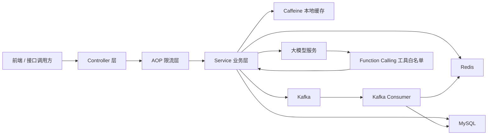

# 跃动一本地生活与大促平台架构设计文档

## 1. 文档目标

本文档记录本项目的整体架构、核心模块设计、关键技术取舍和后续变更原则。项目开发过程中，如果实际实现与本文档不一致，必须先回到本文档更新设计，再继续实现或验收。

## 2. 项目定位

本项目基于黑马点评 `hmdp` 初始化工程改造，目标是构建一个覆盖本地生活浏览、优惠券秒杀、订单状态管理、缓存治理、接口限流和智能客服的后端项目。

项目重点不是增加页面功能，而是围绕 Java 后端面试高频场景，把以下问题做成可运行、可测试、可解释的工程闭环：

- 高并发秒杀下的库存超卖问题
- 一人一单与重复消费幂等问题
- 同步下单链路的请求削峰问题
- 商户热点数据的缓存穿透、击穿和一致性问题
- 订单支付与超时关单并发更新问题
- 热点数据访问对 Redis 的压力问题
- 恶意请求、刷券请求对接口的冲击问题
- 大模型接入业务系统时的工具调用边界问题

## 3. 当前代码基线

当前本地工程已经具备以下基础能力：

- Spring Boot Web 项目骨架
- MyBatis-Plus 实体、Mapper、Service 基础结构
- MySQL 表结构脚本 `hmdp.sql`
- Redis 登录态能力
  - 短信验证码写入 Redis
  - 登录成功后将用户信息写入 Redis Hash
  - 基于 Token 的登录态识别
  - 双拦截器完成登录态刷新和登录校验
- 商户、优惠券、博客等基础 Controller

当前待补齐的核心能力：

- 秒杀接口仍未实现
- 商户查询仍直接访问 MySQL，未接入缓存治理
- Kafka 异步下单已接入阶段 1B；Caffeine、限流、订单状态流转和智能客服尚未接入

## 4. 总体架构

项目采用单体 Spring Boot 架构，在单应用内划分业务模块，通过 Redis、Kafka、MySQL 和大模型服务支撑不同场景。

核心原则：

- Redis 负责高频读写、秒杀预扣和会话类数据。
- MySQL 负责最终业务事实，以唯一索引和乐观条件更新作为最终兜底。
- Kafka 负责异步削峰、失败重试和补偿。
- Caffeine 负责本机热点数据加速，降低 Redis 压力。
- AOP 限流负责在业务执行前拦截异常流量。
- 大模型只通过 Function Calling 白名单调用受控工具，不直接操作数据库。

## 5. 模块设计

### 5.1 Redis 登录与会话共享

已实现方案：

- 验证码 Key：`login:code:{phone}`
- 登录态 Key：`login:token:{token}`
- 登录态存储结构：Redis Hash
- 登录态续期：请求进入后由 `RefreshTokenInterceptor` 刷新 TTL
- 登录校验：由 `LoginInterceptor` 判断 `UserHolder` 中是否存在用户

设计理由：

- Redis 独立于应用实例，适合分布式会话共享。
- Token 模式适合前后端分离。
- Hash 结构便于按字段读取用户摘要信息。

### 5.2 秒杀主链路

目标链路：

1. 管理端新增秒杀券。
2. MySQL 保存优惠券与秒杀券信息。
3. Redis 同步写入秒杀库存。
4. 用户请求秒杀接口。
5. Lua 脚本在 Redis 内原子完成库存判断、一人一单判断、扣减库存和记录用户抢购资格。
6. 秒杀接口生成订单号，并发送 Kafka 下单消息。
7. Kafka Consumer 异步扣减 MySQL 库存并创建订单。
8. 数据库唯一索引和库存乐观条件更新作为最终一致性兜底。

当前开发拆分：

- 阶段 1A：在 Kafka 未安装前，先完成 Redis + Lua 秒杀资格判断闭环。接口调用 Lua，成功时通过 Redis 全局 ID 生成订单号并返回；失败时返回“库存不足”或“不能重复下单”。本阶段只预扣 Redis 库存和记录抢购用户，不创建 MySQL 订单，也不发送 Kafka 消息。
- 阶段 1B：Kafka 环境补齐后，将阶段 1A 生成的订单号、用户 ID、券 ID 和创建时间封装为下单消息发送到 `voucher-order-create`，由 Consumer 异步落 MySQL 订单并扣减数据库库存。Topic 由 `KafkaTopicConfig` 声明为 1 分区、1 副本，适配本地 Docker 单节点 Kafka。

核心 Redis Key：

- 秒杀库存：`seckill:stock:{voucherId}`
- 用户抢购记录：`seckill:order:{voucherId}`

核心 Kafka Topic：

- 下单消息：`voucher-order-create`
- 下单死信或补偿消息：`voucher-order-create-dlt`

数据库兜底：

- `tb_voucher_order` 增加 `user_id + voucher_id` 唯一约束。
- `tb_seckill_voucher` 扣减库存时使用 `stock > 0` 条件。

设计理由：

- Lua 在 Redis 单线程执行模型下保证脚本内多个操作的原子性。
- Redis 预扣库存让高并发请求不直接打到 MySQL。
- Kafka 将资格判断和订单落库解耦，削平数据库写入峰值。
- 唯一索引和乐观扣减保证 Redis 或 Kafka 异常时数据库仍能守住最终事实。

### 5.3 Kafka 异步下单与幂等

消息内容：

- `orderId`
- `userId`
- `voucherId`
- `createTime`
- `traceId` 后续接入链路追踪时补充；当前阶段 1B 先落 `orderId/userId/voucherId/createTime` 四个核心字段。

Consumer 处理流程：

1. 根据 `orderId` 或 `userId + voucherId` 判断是否已处理。
2. 扣减 MySQL 秒杀库存，条件为 `voucher_id = ? and stock > 0`。
3. 创建订单，初始状态为待支付。
4. 消费失败时进入重试；超过重试次数后进入死信或补偿流程。

设计理由：

- Kafka 至少一次投递要求消费端必须幂等。
- 数据库唯一索引可以处理重复消费、重复请求和并发插入。
- 死信或补偿流程可以保留失败消息，便于后续修复和重放。

### 5.4 订单状态流转

目标状态：

- `1`：待支付 / 未支付
- `2`：已支付
- `3`：已核销
- `4`：已取消
- `5`：退款中
- `6`：已退款

核心流程：

- 秒杀异步创建订单后，订单状态为待支付。
- 支付接口只允许将待支付订单更新为已支付。
- Spring Task 扫描超时待支付订单，只允许将待支付订单更新为已取消。
- 支付和关单都使用状态条件更新，避免并发覆盖。

设计理由：

- 订单状态是订单生命周期的核心事实。
- 条件更新是一种轻量乐观锁，能处理支付与关单并发。
- 定时任务适合本地项目演示超时关单能力。

### 5.5 商户缓存治理

目标能力：

- 缓存穿透：查询不存在商户时写入空值，设置短 TTL。
- 缓存击穿：热点商户使用逻辑过期，过期后先返回旧值，再异步重建缓存。
- 缓存一致性：更新数据库后删除缓存；删除失败时发送补偿消息重试。
- TTL 兜底：即使删除失败，脏缓存也不会永久存在。

核心 Redis Key：

- 商户缓存：`cache:shop:{shopId}`
- 商户缓存重建锁：`lock:shop:{shopId}`
- 商户缓存删除补偿 Topic：`shop-cache-delete-retry`

设计理由：

- 缓存空值减少恶意不存在 ID 对数据库的冲击。
- 逻辑过期避免热点 Key 过期瞬间大量请求击穿到 MySQL。
- 先更新数据库再删除缓存，配合补偿和 TTL，能够在实现复杂度和一致性之间取得清晰边界。

### 5.6 Caffeine + Redis 二级缓存

查询顺序：

1. 查询 Caffeine 本地缓存。
2. 未命中时查询 Redis。
3. Redis 未命中时查询 MySQL。
4. 查询成功后回填 Redis 和 Caffeine。

更新策略：

- 商户数据更新后删除 Redis 缓存。
- 同时删除本地 Caffeine 缓存。
- Caffeine 设置最大容量和短 TTL，避免长期持有旧数据。

设计理由：

- Caffeine 提供进程内访问速度，适合热点数据。
- Redis 作为分布式缓存，保证多实例之间有统一缓存层。
- 本地缓存无法天然跨实例同步，因此必须用短 TTL 和更新删除兜底。

### 5.7 Redis + AOP + 注解限流

目标能力：

- 定义 `@RateLimit` 注解描述限流规则。
- AOP 在 Controller 方法执行前完成限流判断。
- 支持全局、IP、用户多维度限流。
- Redis 记录窗口内请求次数或滑动窗口数据。

设计理由：

- 注解让限流规则贴近接口声明，便于维护。
- AOP 避免每个接口重复写限流逻辑。
- Redis 适合多实例共享限流状态。

### 5.8 LangChain4j 智能客服

目标能力：

- 使用 Redis 保存用户会话记忆。
- 使用 Function Calling 暴露受控工具。
- 工具白名单包括商户信息查询、优惠券查询、预约到店。
- 工具入参必须校验，调用过程必须记录日志。

设计理由：

- 大模型负责理解自然语言，不直接操作核心数据。
- Function Calling 将模型能力限制在后端定义的工具边界内。
- Redis 会话记忆能支持多轮对话。

## 6. 测试与验收策略

本项目采用 TDD 开发方式：

1. 每个小功能先写自动化测试。
2. 运行测试，确认因功能缺失而失败。
3. 编写最小实现。
4. 运行测试，确认通过。
5. 阶段内完成多个小功能后，由人工进行完整阶段验收。

人工验收按阶段进行：

- 阶段 1：秒杀主链路验收
- 阶段 2：订单状态流转验收
- 阶段 3：商户缓存治理验收
- 阶段 4：二级缓存与接口限流验收
- 阶段 5：智能客服验收

每个阶段完成后，需要同步以下内容：

- 已实现能力
- 自动化测试结果
- 人工测试步骤
- 预期结果
- 常见失败原因
- 面试可讲的代码入口和核心流程

## 7. 设计变更规则

如果开发过程中发现本文档与实际实现不一致，必须遵守以下规则：

1. 先更新本文档，说明新的设计。
2. 在开发过程文档中记录变更原因。
3. 再继续实现或验收。
4. 面试话术以实际代码和更新后的架构设计为准。
