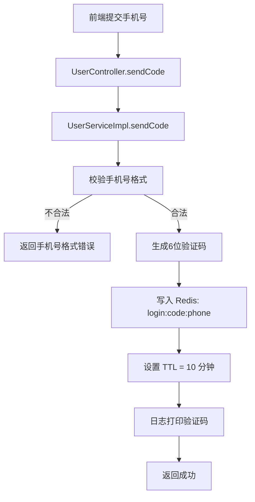
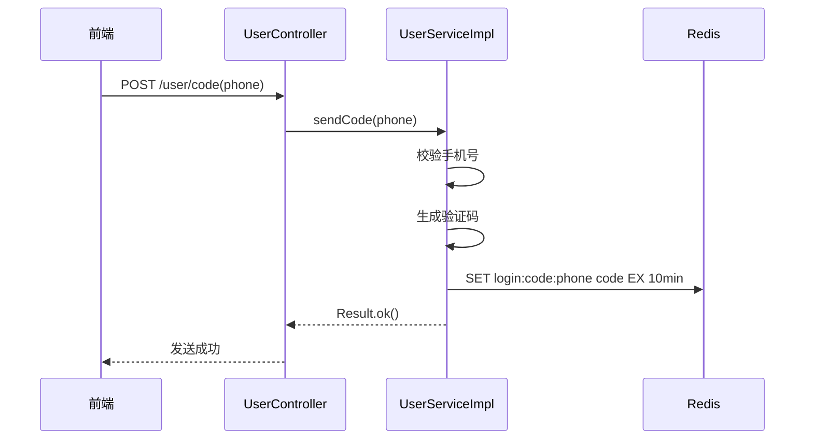
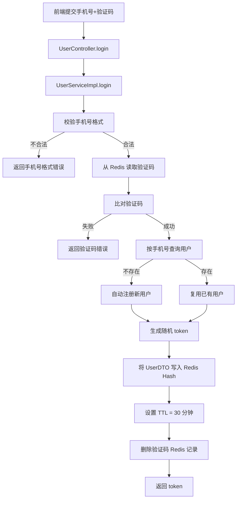
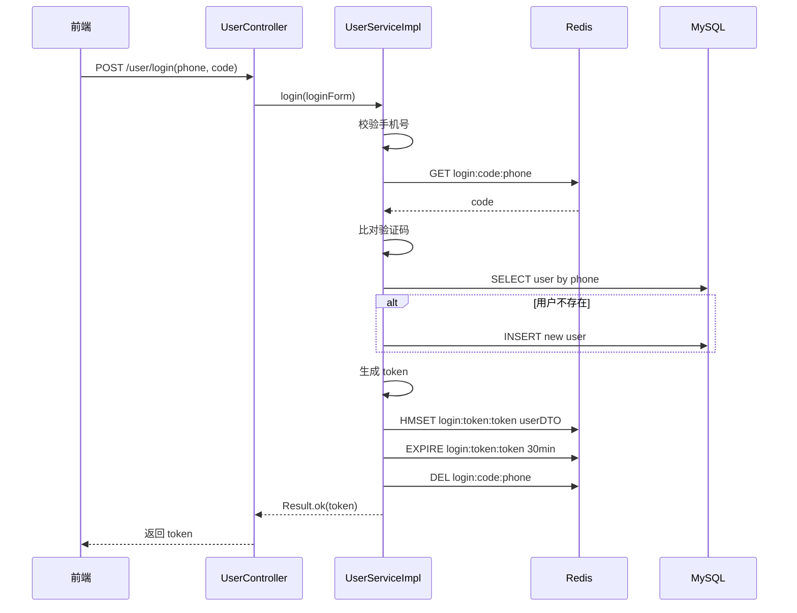
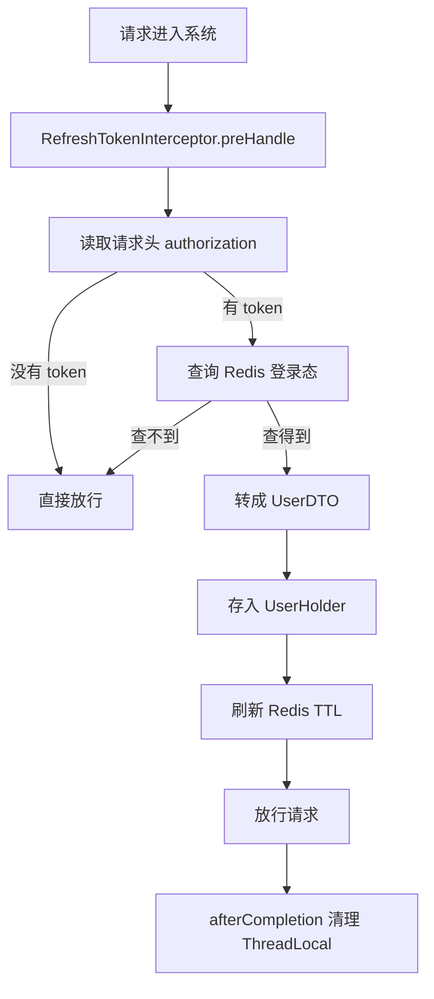
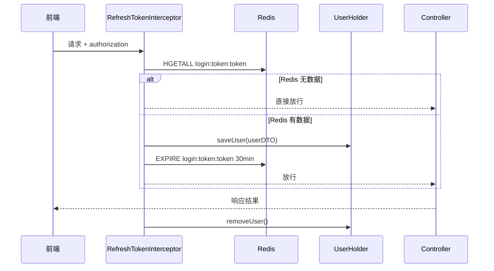
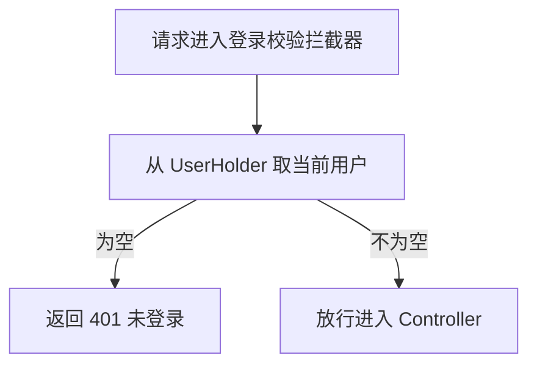
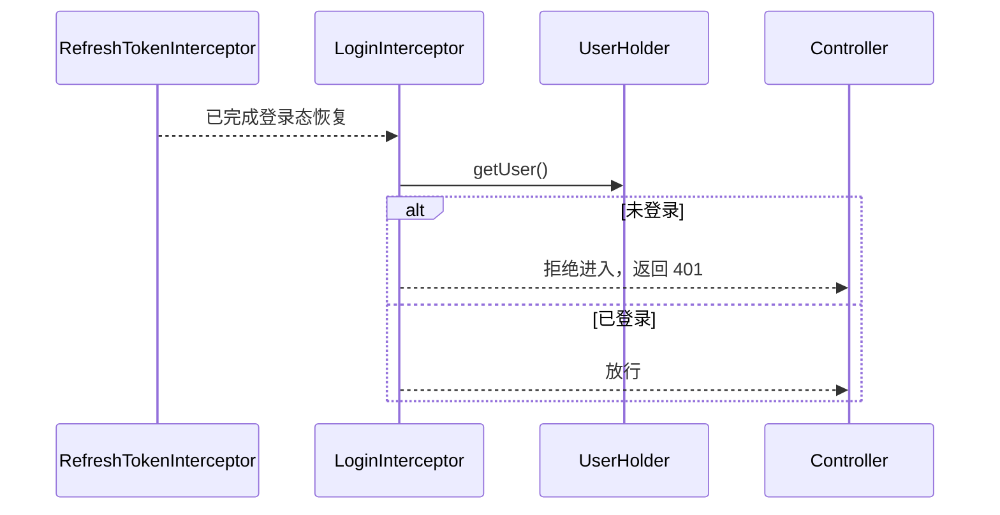
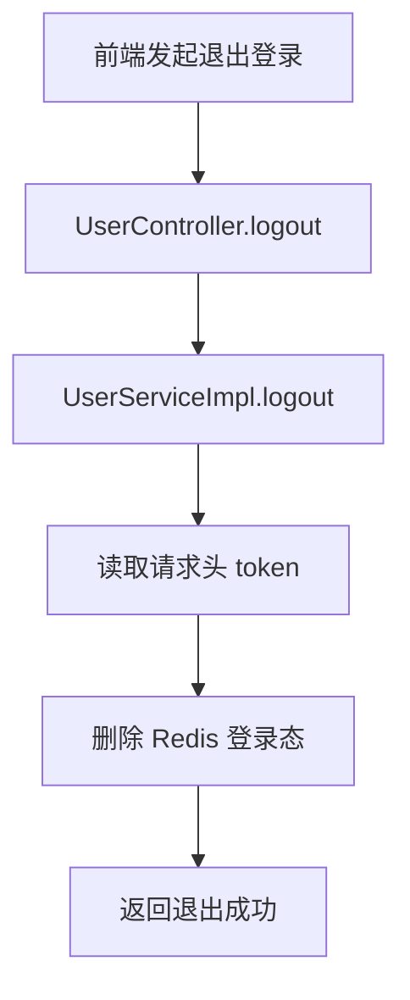
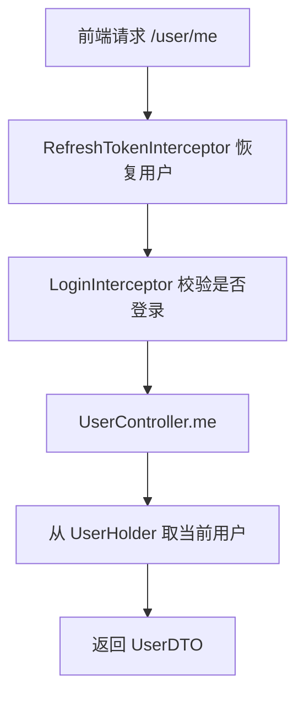

# Redis 登录、短信验证码与登录拦截技术报告

## 1. 本次开发目标

本次开发的目标，是在当前 `hmdp` Spring Boot 项目中，基于 Redis 实现一套可运行的登录体系，替代传统 `HttpSession` 方案，覆盖以下能力：

- 短信验证码发送与校验
- 用户登录与自动注册
- 登录态持久化到 Redis
- 基于 Token 的会话识别
- 登录拦截
- 登录态自动续期
- 用户登出

本次实现面向当前本地开发环境，短信发送环节采用“生成验证码并打印日志”的方式模拟，便于联调和验证。

## 2. 为什么选择 Redis 方案

### 2.1 基于 Session 的主要缺点

- Session 默认保存在单台应用服务器内存中，不适合多实例部署
- 在分布式或集群环境下，用户请求打到不同服务器时，会出现登录态不共享的问题
- Session 共享通常需要额外中间件或容器方案，维护成本更高
- 随着在线用户增长，Session 会持续占用应用服务器内存
- 前后端分离、移动端、多端登录等场景下，Session 的适配性较差

### 2.2 基于 Redis 的优点

- Redis 独立于应用服务之外，天然适合分布式会话共享
- 读写性能高，适合存储验证码和登录态
- 支持 TTL，便于控制验证码过期和登录过期
- Token 模式更适合前后端分离项目
- 多台服务节点都可以读取同一份用户会话数据

### 2.3 基于 Redis 的代价

- 系统多依赖一个 Redis 组件，架构复杂度会上升
- 需要自行设计 key、TTL、拦截器和续期策略
- 如果 Redis 不可用，登录能力会受到影响
- 如果 Token 管理不规范，会带来安全风险

## 3. 方案总览

本次采用的是“验证码登录 + Redis 会话存储 + 双拦截器”的方案。

### 3.1 验证码存储方案

- Redis 数据类型：`String`
- key 设计：`login:code:{phone}`
- value：6 位短信验证码
- TTL：10 分钟

### 3.2 登录态存储方案

- Redis 数据类型：`Hash`
- key 设计：`login:token:{token}`
- field：`id`、`nickName`、`icon`
- TTL：30 分钟

### 3.3 Token 设计

- 登录成功后生成随机 Token
- 本次采用 `UUID` 作为 Token
- 前端后续请求通过请求头 `authorization` 携带 Token

## 4. 代码实现说明

本节按照实际代码中的工作流注释方式，拆成“1、2、3、4”的步骤说明，并补充流程图和时序说明。

### 4.1 发送验证码实现

对应代码：

- `src/main/java/com/hmdp/controller/UserController.java`
- `src/main/java/com/hmdp/service/impl/UserServiceImpl.java`

工作流说明：

1. 前端调用 `POST /user/code`，提交手机号
2. 后端校验手机号格式是否正确
3. 生成 6 位随机验证码，并写入 Redis
4. 设置验证码 TTL 为 10 分钟，并通过日志打印验证码

流程图：



时序说明：



### 4.2 登录实现

对应代码：

- `src/main/java/com/hmdp/controller/UserController.java`
- `src/main/java/com/hmdp/service/impl/UserServiceImpl.java`

工作流说明：

1. 前端调用 `POST /user/login`，提交手机号和验证码
2. 后端从 Redis 中读取验证码并校验
3. 根据手机号查询用户，不存在则自动注册
4. 生成随机 Token，将用户简要信息写入 Redis Hash，并返回 Token

流程图：



时序说明：



### 4.3 刷新 Token 拦截器实现

对应代码：

- `src/main/java/com/hmdp/utils/RefreshTokenInterceptor.java`

工作流说明：

1. 拦截所有请求，从请求头中读取 `authorization`
2. 若没有 Token 或 Redis 中查不到登录态，则直接放行
3. 若 Redis 中存在用户信息，则转换为 `UserDTO` 放入 `UserHolder`
4. 刷新 Redis 中该 Token 的 TTL，请求结束后清理 `ThreadLocal`

流程图：



时序说明：



### 4.4 登录拦截器实现

对应代码：

- `src/main/java/com/hmdp/utils/LoginInterceptor.java`
- `src/main/java/com/hmdp/config/MvcConfig.java`

工作流说明：

1. 登录拦截器只负责保护需要登录的接口
2. 从 `UserHolder` 中获取当前登录用户
3. 若当前用户为空，返回 `401`
4. 若当前用户存在，则允许进入 Controller

流程图：



时序说明：



### 4.5 登出实现

对应代码：

- `src/main/java/com/hmdp/controller/UserController.java`
- `src/main/java/com/hmdp/service/impl/UserServiceImpl.java`

工作流说明：

1. 前端调用 `POST /user/logout`
2. 后端从请求头读取 Token
3. 删除 Redis 中 `login:token:{token}` 对应登录态
4. 返回退出成功结果

流程图：



### 4.6 获取当前登录用户实现

对应代码：

- `src/main/java/com/hmdp/controller/UserController.java`

工作流说明：

1. 请求先经过刷新 Token 拦截器
2. 刷新 Token 拦截器将用户写入 `UserHolder`
3. Controller 从 `UserHolder` 取出当前用户
4. 返回当前登录用户信息

流程图：



## 5. 拦截器配置策略

配置类：`MvcConfig`

### 5.1 `RefreshTokenInterceptor`

- 拦截路径：`/**`
- 顺序：`0`
- 作用：恢复用户上下文、刷新登录 TTL

### 5.2 `LoginInterceptor`

- 顺序：`1`
- 默认保护需要登录的接口
- 放行以下公开路径：

`/shop/**`  
`/shop-type/**`  
`/voucher/**`  
`/upload/**`  
`/blog/hot`  
`/user/code`  
`/user/login`  
`/user/info/**`

## 6. Redis Key 设计

### 6.1 验证码 Key

- 前缀：`login:code:`
- 示例：`login:code:13800138000`
- 值：验证码字符串
- TTL：10 分钟

### 6.2 用户登录态 Key

- 前缀：`login:token:`
- 示例：`login:token:4b4b3c8d3d7d4b849f1c2e4f16f1e888`
- 值类型：`Hash`
- 典型字段：
- `id`
- `nickName`
- `icon`
- TTL：30 分钟

## 7. 本次修改的核心代码文件

### 7.1 业务接口与实现

- `src/main/java/com/hmdp/controller/UserController.java`
- `src/main/java/com/hmdp/service/IUserService.java`
- `src/main/java/com/hmdp/service/impl/UserServiceImpl.java`

### 7.2 拦截器与配置

- `src/main/java/com/hmdp/utils/RefreshTokenInterceptor.java`
- `src/main/java/com/hmdp/utils/LoginInterceptor.java`
- `src/main/java/com/hmdp/config/MvcConfig.java`

### 7.3 常量调整

- `src/main/java/com/hmdp/utils/RedisConstants.java`

## 8. 关键技术点说明

### 8.1 为什么用户信息只存 `UserDTO`

- `User` 实体字段更多，不适合直接作为会话对象
- 登录态只需要最小必要信息
- 使用 `UserDTO` 可以降低 Redis 存储成本
- 更利于权限隔离和接口返回

### 8.2 为什么使用 `ThreadLocal`

- Controller、Service 层都能方便获取当前用户
- 不需要层层传参
- 但必须在请求结束后及时清理，避免线程复用污染

### 8.3 为什么要做登录态续期

- 如果只在登录时设置一次 TTL，活跃用户也会突然掉线
- 引入刷新机制后，活跃用户会持续续期
- 不活跃用户会自然过期，更符合真实业务体验

## 9. 验证结果

本次改造完成后，已执行 Maven 编译验证：

```bash
mvn -q -DskipTests compile
```

结果：

- 编译通过
- 当前 Redis 登录、验证码、拦截器相关代码无编译错误

## 10. 当前方案的边界与后续可扩展项

### 10.1 当前边界

- 短信验证码仅通过日志模拟发送
- 当前仅实现验证码登录，未启用密码登录分支
- Token 直接使用 UUID，未引入签名机制
- 登出为“删除 Redis 会话”模式

### 10.2 后续建议扩展

- 接入真实短信网关
- 为验证码增加发送频控
- 为登录接口增加防刷和限流
- 为 Token 增加设备维度或客户端维度管理
- 将拦截器从 `utils` 包迁移到独立 `interceptor` 包
- 增加接口联调测试和集成测试

## 11. 总结

本次实现已经将当前项目的登录体系从“待开发状态”推进到“基于 Redis 的可运行状态”，核心收益如下：

- 验证码不再依赖 Session，而是统一交给 Redis 管理
- 登录态从单机 Session 转为可共享的 Redis Token 会话
- 通过双拦截器实现了“用户识别”和“强制登录校验”的职责分离
- 通过 TTL 刷新机制实现了更合理的登录续期
- 方案与当前 Spring Boot + Redis + MyBatis-Plus 项目结构兼容，后续可继续扩展签到、缓存、秒杀等 Redis 能力
